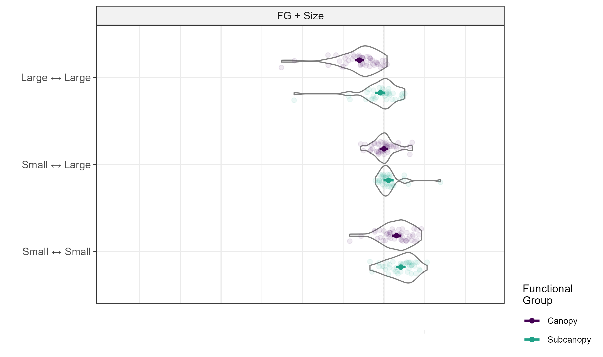
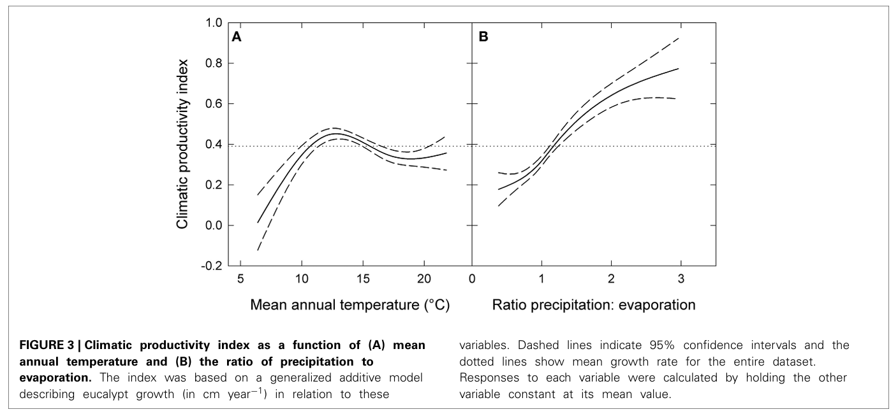

# Covariates to FG + Size Model

In `explore_site_covars.qmd` we explored the correlation structure and variation in the different site covariates we can pull out from the different places. We have a select few variables that we can now use to see if there a relationship between site covariates and the interactions within-groups.

We are using the FG + Size model here as covariates are the site-level, so a model where the replication is at the site-level, and where is there one interaction for a group of individuals per site is easiest (and makes the most sense).

We use the within-group interactions as these are the strongest and have the most direct relation to a size interaction and functional group. However, there are 6 levels of within-group interactions per site. We have functional groups Subcanopy and Canopy, with the size interactions of large - large, large - small, and small - small. The fig below shows the raw data points and spread of these for the within-group interactions for the FG + Size Model with the predicted linear model results overlaid on top:

{fig-align="center"}

So, the question is now how can we set up the linear models to understand the relationships between covariates and interaction strength + direction.

glm( alpha? \~\
covar + covar + covar + ...)

Which alpha should we be using? We cannot make one alpha for the entire site because that destroys the actual structure of our analysis.

We are interested in competition and clustering of individuals, and how this may change with the variation in environment between sites. Our hypotheses are:

1.  There will be stonger competition of individuals in sites with more optimal conditions for tree growth as these sites will provide the ecological space for more individuals (moderate temperatures, higher rainfall, high nitrogen, high carbon, high fpi, isothermality might be related to npp??).

Note: Isothermality basically describes the day-night range divided by the annual range (so ratio of day to night change compared to seasonal change). So tropical areas will have similar isothermality and temperate areas will have similar. Probably why it helped to spilt up the sites so well, but what does it mean for tree growth? It's strongly correlated to precipitation of driest quarter which might be better to use...

## Load data

### Load in within-group interactions

```{r}
library(dplyr)
library(stringr)
library(performance)
library(ggeffects)
library(ggplot2)
library(gt)
library(glmmTMB)
library(forcats)
library(ggrepel)
```

```{r}
fg_size <- read.csv("../model_specifications/fg_size/fg_size_df_t15_updated.csv")
```

And clean this:

```{r}
fg_size <- fg_size %>% 
  filter(class_from == class_to)  
```

### Load in covariates

```{r}
site_covars <- read.csv("../../data/site_covariates_new.csv")

## Or please use this to run final 
site_covars <- read.csv("final_covars.csv")

#Need to add in a covariate we can make: 
site_covars$P_E <- site_covars$annual_precip / site_covars$annual_PET

#covars we selected: 
site_covars <- site_covars |> 
  select(c("Site_Name",
           "georegion",
           "annual_precip",
           "annual_mean_temp", #adding this creates high degree of space between nsw and vic/tas groups but brings these groups together
           "basal_area_m2_ha", #including this brings vic and nnsw closer together
           "fpi", 
           "no_species",
           "isothermality",
           "temp_seasonality", 
           "mean_temp_driest_quart",
           "P_E"))

```

### Attach interactions and environment into a df

Clean fg_size first and get relevant columns:

```{r}
fg_size <- fg_size |> 
  rename(Site_Name = site) |> 
  mutate(size_int = case_when(size_int == "small small" ~ "Small ↔ Small", 
                              size_int == "small large" ~ "Small ↔ Large", 
                              size_int == "large large" ~ "Large ↔ Large")) |>
  mutate(size_int = as.factor(size_int)) |> 
  mutate(size_int = fct_relevel(size_int, "Small ↔ Small", 
                                "Small ↔ Large", 
                                "Large ↔ Large")) |> 
  select(c("Site_Name",
           "alpha", 
           "size_int", 
           "class_from"))
```

Create joined df

```{r}
covars <- full_join(site_covars, 
                    fg_size, 
                    by = "Site_Name")
```

## Scale and centre covariates

We need to centre and scale the covariates that we are using so that they can be easily interpreted. Can use the inbuilt scale function.

```{r}
range(site_covars$annual_mean_temp)
range(site_covars$annual_precip)
range(site_covars$P_E)
```

```{r}
covars$annual_precip <- scale(covars$annual_precip)
range(covars$annual_precip)

covars$annual_mean_temp <- scale(covars$annual_mean_temp)
range(covars$annual_mean_temp)

covars$P_E <- scale(covars$P_E)
range(covars$P_E)

```

## Formulas for linear modelling

Before separating let's try a model with all the terms in it. But to do that we need to know what combination of interaction terms gives us the best model.

```{r}
# vars <- c("annual_mean_temp", "annual_precip", "class_from", "size_int")
# comb.vars <- expand.grid(vars, vars, vars, stringsAsFactors = FALSE)
# comb.vars <- as.data.frame(t(apply(comb.vars, #transpose because of how apply returns
#                        1, #apply sort for all rows
#                        sort)))
# comb.vars <- unique(comb.vars) #keep all unique rows 
# 
# #get rid of double ups in rows
# comb.vars[] <- #to preserve structure 
#   t(apply(comb.vars, 1, 
#           function(x) replace(x, duplicated(x), "")))
# 
# #make terms 
# int_vars <- apply(comb.vars, 1, function(x) 
#   paste(x[x != ""], collapse = "*")) #skip pasting when blank 
# 
# #add four way interaction into int_vars 
# int_vars <- c(int_vars, "annual_mean_temp*annual_precip*class_from*size_int")
# 
# #put back into a df for manually making combinations 
# comb.vars <- data.frame(ints = int_vars)
# comb.vars <- comb.vars |> distinct(ints, .keep_all = TRUE) #there's some duplication again so remove
# 
# #remake the vector just in case
# int_vars <- comb.vars$ints
```

Combine interactions into batches of exhaustive combinations (code from here: <https://stackoverflow.com/questions/50294415/run-all-possible-interactions-in-glm-regression-using-r>).

But exhaustive combinations do not make ecological sense. We are interested in how important labels of individuals 'versus' environment of sites are to alpha. So we do not want every single possible combination of predictors. There are 15 unique terms including interactong terms that we can include

```{r}
# comb.vars <- list(int_vars) #list to store combns of different size
# k <- length(int_vars) - 1
# 
# while(k > 1){ #generates combinations more than 1
#   combs <- t(combn(int_vars, k)) #all combinations of ints, t so row is combn
#   comb.vars <- c(comb.vars, split(combs, seq(nrow(combs)))) #spilt into list groups
#   k <- k-1 #condition to exit
# }
# 
# comb.vars #there's quite a few combinations here, so this isn't a useful way to do this
```

\
What we need to do is create a dataframe with all the combinations that we want to include so that we can attach the formulas to a loop (see next chunk).

To decide which terms to include, I have followed the following rules:

1.  The model must build on our reference model of size + FG + size\*FG (this already explained a lot of variation)

2.  We have two climate variables of temperature and rainfall, these cannot have any two way variables with either FG or size because, a. productivity forms a relationship with both temperature and rainfall and these should not be separated and attached separately to ecological variables and b. a saturated model shows these two-way interactions have negligible effect on alpha

3.  Therefore, for terms we have the following options:

    a\. 1-way: FG, size, temp, rainfall

    b\. 2-way: FG \* size, temp \* rainfall

    c\. 3-way: temp \* rainfall \* size , temp \* rainfall \*FG

    d\. 4-way: temp \* rainfall \* size \* FG

    Using these options we can write a csv file with the combination of terms we are interested in having forming formulas:

```{r}
forms <- read.csv("formulas_var.csv")
```

## Run GLMM models

Then create formulas for everything and run GLM

```{r}
res <- list() 

for(i in 1:nrow(forms)){
 
  vars <- forms[i, 2:16] #to deal with empty cols 
  vars <- vars[vars != "" & !is.na(vars)]
  
   f <- formula(paste("alpha ~ 1 + (1 | Site_Name) + ", 
                      paste(vars, collapse = "+"))) 
   
   fit <- glmmTMB(f, 
                  data = covars)
   
  working_res <- list(fit)
  
  res <- append(res, working_res)
  
}
```

```{r}
res_names <- list(NULL)
for(i in 1:nrow(forms)){
  res_names[i] <- paste0("res[[", i, "]]")
}

cat(paste(res_names, collapse = ", "))

#can run summary on models, res[[14]] is the full model
summary(res[[14]])
```

And now compare performance to choose what might be the most important. Some models were singular (i.e. no random effect) and so only have a marginal r2:

ICC is decreasing between 20 and 16, the variation of the site effect is reduced

look of estimate of site random effect and see how much that is reduced by the adding of climate predictors, what proportion of that variation is reduced

scatterplot of metrics against metrics

```{r}
perf <- compare_performance(res[[1]], res[[2]], res[[3]], res[[4]], res[[5]], res[[6]], res[[7]], res[[8]], res[[9]], res[[10]], res[[11]], res[[12]], res[[13]], res[[14]], res[[15]], res[[16]], res[[17]], res[[18]], res[[19]], res[[20]])
perf
```

\

\
In addition to R2, AIC, AICc and BIC we can also do an ANOVA test to compare the different models.

For now, running an anova on the models that explained more variation and lowest AIC.

```{r}
anova(res[[5]], res[[7]], res[[11]], res[[12]], res[[10]])
```

And compare everything. Model 1 and 2 are not a good comparison so removing:

```{r}
anova(res[[3]], res[[4]], res[[5]], res[[6]], res[[7]], res[[8]], res[[9]], res[[10]], res[[11]], res[[12]], res[[13]], res[[14]], res[[15]], res[[16]], res[[17]], res[[18]], res[[19]])
```

So having a interaction between temperature and rainfall and fg and size makes the model significantly different (models 4 and 5). Adding a four-way or three-way interactions between the climate and aspects of the individuals also make the models significantly different (models 10 and 15). Model 16 has temp\* *precip \** size interaction added (the only significant interaction between climate and ecology)...

So we have AIC, R2 and ANOVA that are telling us different things about which model is best. Let's consolidate what everything is saying to get a better understanding of what model to choose.

1.  Both AIC and AICc (which penalising more parameters) find:

    a\. Models alpha \~ 1 + class_from + size_int + annual_mean_temp + annual_precip + class_fromxsize_int + annual_mean_tempxannual_precip + (1 \| Site_Name) (5) and\
    alpha \~ 1 + class_fromxsize_int + annual_mean_tempxannual_precip + (1 \| Site_Name) (7) both have the same AIC of -114.47 and R2 of 0.4745.

    b\. We can get a better AIC value of -115.68 by including the interaction term of temp x precip x size. The R2 also increases to 0.5054.

    c\. Including the temp x precip x class_from interaction increases the AIC to -113.34 and increases the R2 to 0.5147.

    d\. Models with more added interactions have a higher AIC, but the R2 can get to 0.5240.

2.  This is where we should look to the ANOVA results to see what models are significantly different.

    a\. ANOVA shows that the interactions of temp x precip and class x size make the model significantly different

    b\. Model 16 where there is temp x precip x size also is significantly different

    c\. Model 10 is 1 + annual_mean_temp + annual_precip + class_from x size_int + annual_mean_temp x annual_precip + annual_mean_temp x annual_precip x class_from x size_int + (1 \| Site_Name), and,

    Model 15 is annual_mean_temp x annual_precip x size_int + annual_mean_temp x class_from x size_int + annual_precip x class_from x size_int + class_from x annual_precip + annual_mean_temp x annual_precip x class_from x size_int + class_from x annual_mean_temp + size_int x annual_mean_temp + size_int xannual_precip + (1 \| Site_Name). Model 15 makes no ecological sense and is just too complicated to understand, and in this line of thinking makes sense why it is significantly different. Model 10 however contains the four-way interaction but no three way interaction, yet has a higher AIC and lower R2 than some other feasible options.

So what model is the best option?

4% more variation is explained when we add climate as compared to class+size+class\*size...

```{r}

summary(res[[16]])
ggpredict(res[[16]],
          terms = c("annual_precip", "annual_mean_temp", "size_int", "class_from")) |> 
  plot(show_data = TRUE, 
       jitter = TRUE) +
  geom_hline(yintercept = 0, linetype = "dotted") 

ggpredict(res[[16]],
          terms = c("annual_precip", "annual_mean_temp", "size_int", "class_from")) |> 
  plot(show_data = TRUE, 
       jitter = TRUE) +
  geom_hline(yintercept = 0, linetype = "dotted") 


```

## Use P:E Instead of Precipitation

In Prior & Bowman's paper relating tree growth to competition and climate, their climate variable was constructed from annual mean temperature and the ratio of precipitation to evaporation as an index of water availability. In the absence of a better metric, we can also attempt to use this ratio as a proxy of soil moisture. We can run the same analysis we did previously, calculating AIC, R2 and ANOVA for the different models. In particular we can see if using the ration fo P:E is better than raw precipitation.

We have already centered and scaled P:E so that it is on a similar range and center of annual_temperature.

\
The formulas we are checking against are the same, just changing all instance of `annual_precip` to `P_E`. Covars has all relevant columns so we keep the data the same.

```{r}

forms_pe <- forms |> 
  mutate(across(everything(), ~ #tilde when giving function
                  str_replace_all(., "annual_precip", "P_E")))
# 
# forms_pe <- forms |> #another option to do the same thing 
#   mutate_all(funs( 
#                   str_replace_all(., "annual_precip", "P_E")))

#and then run the same code as before to loop through all formulas 

res_pe <- list() 

for(i in 1:nrow(forms_pe)){
  
  vars <- forms_pe[i, 2:16] #to deal with empty cols 
  vars <- vars[vars != "" & !is.na(vars)]
  
  f <- formula(paste("alpha ~ 1 + (1 | Site_Name) + ", 
                     paste(vars, collapse = "+"))) 
  
  fit <- glmmTMB(f, 
                 data = covars)
  
  working_res <- list(fit)
  
  res_pe <- append(res_pe, working_res)
  
}
```

Produce table of performance similar to before:

```{r}
res_names <- c(NULL)
for(i in 1:nrow(forms)){
  res_names[i] <- paste0("res_pe[[", i, "]]")
}
toString(res_names)#unfortunately cant find a clean way to put this into the below function :(

perf_pe <- compare_performance(res_pe[[1]], res_pe[[2]], res_pe[[3]], res_pe[[4]], res_pe[[5]], res_pe[[6]], res_pe[[7]], res_pe[[8]], res_pe[[9]], res_pe[[10]], res_pe[[11]], res_pe[[12]], res_pe[[13]], res_pe[[14]], res_pe[[15]], res_pe[[16]], res_pe[[17]], res_pe[[18]], res_pe[[19]], res_pe[[20]], res_pe[[21]], res_pe[[22]], res_pe[[23]])

#supply meaningful names to Name column in performance dataframe 
perf_pe <- as.data.frame(perf_pe)
perf_pe$Name <- forms_pe$Model

perf_pe
```

When using P_E, the same models are found to be the best performing in terms of AIC. The model with P_E explains \~2% more variation in the dataset for the best models (in particular models with interactions, i.e. 10, 16, 18, 19)\

Compare the model effects:

```{r}
summary(res[[16]])

summary(res_pe[[16]])
```

```{r}
ggpredict(res[[16]],
          terms = c("annual_precip", "annual_mean_temp", "size_int", "class_from")) |> 
  plot(show_data = TRUE, 
       jitter = TRUE) +
  geom_hline(yintercept = 0, linetype = "dotted") 

ggpredict(res_pe[[7]],
          terms = c("P_E", "annual_mean_temp", "size_int", "class_from")) |> 
  plot(show_data = TRUE, 
       jitter = TRUE) +
  geom_hline(yintercept = 0, linetype = "dotted") 


```

```{r}
summary(res[[18]])
summary(res_pe[[18]])

ggpredict(res[[18]],
          terms = c("annual_precip", "annual_mean_temp", "size_int", "class_from")) |> 
  plot(show_data = TRUE, 
       jitter = TRUE) +
  geom_hline(yintercept = 0, linetype = "dotted") 

ggpredict(res_pe[[18]],
          terms = c("P_E", "annual_mean_temp", "size_int", "class_from")) |> 
  plot(show_data = TRUE, 
       jitter = TRUE) +
  geom_hline(yintercept = 0, linetype = "dotted") 
```

For small-small for both canopy and subcanopy, the higher P:E (less water loss) the more repulsed things are no matter the temperature.

For large-large this pattern is more based on temperature:\
- for lower temperature and less water = clustering\
- for lower temperature and more water = repulsion\
- for higher temperature and less water = repulsion\
- for higher temperature and more water = clustered

Higher P:E = more precipitation than evaporation = more water available

And run an ANOVA. The model with P:E is significantly different to that of the model with annual precipitation.

```{r}
anova(res[[16]], res_pe[[16]]) 
anova(res[[18]], res_pe[[18]])
```

And then within models with P:E, are there any significant differences? In the best 6 models, none are significantly different.

```{r}
anova(res_pe[[20]], res_pe[[10]], res_pe[[19]], res_pe[[16]], res_pe[[18]], res_pe[[12]], res_pe[[11]])
```

There are more significant interactions of functional class and size group with P:E (and also temperature) and when annual precipitation is used in the model. When predicting back out, the P:E models have smaller confidence intervals. I think that this is good reason to use P:E.

In general, the predictions from this larger model are the same as when we run linear models for individual groups.

\*\*Note: In the P:E model 18, there is 6.4% increase in variation explained from class + size + class\*size when adding temp and P:E. \*\* (models are significantly different when climate is added though according to ANOVA)

So there is ***no reason*** to not use P:E over P (it decreases AIC and increases R2). So we use P:E from now on

## Other temperature measures

In Prior and Bowman's work they approximated climate productivity as being related to mean annual temperature by the shape below:



There are multiple sources that show that increased temperatures lead to a decrease/plateau in growth and productivity of forests. It is this aspect of temperature that we wish to understand its effect on competition.

### Transforming Temp

So a linear relationship for temperature doesn't really hold (as we are expecting another shape of relationship). We know (after running a quick pilot analysis) that log of temperature does not give any meaningful change from untransformed temperature, so we need to try other transformations if we want a non-linear temperature shape in our modelling.

We can try to replicate this shape through a series of transformations:

```{r}
temp <- covars$annual_mean_temp
plot(temp, temp)

plot(temp, covars$P_E)
```

```{r}
covars$t_temp <- exp(-site_covars$annual_mean_temp) 
range(covars$t_temp)
covars$t_temp <- scale(covars$t_temp)
```

More transformation (based on Weibull distribution): makes model worse

```{r}
covars$t_temp <- exp(-covars$annual_mean_temp^1.5)
range(covars$t_temp)
covars$t_temp <- scale(covars$t_temp)
```

Try logging: no change

```{r}
covars$t_temp <- log(covars$annual_mean_temp)
range(covars$t_temp)
covars$t_temp <- scale(covars$t_temp)
```

```{r}
forms_t <- forms |> 
  mutate(across(everything(), ~ #tilde when giving function
                  str_replace_all(., "annual_mean_temp", "t_temp"))) |> 
  mutate(across(everything(), ~ #tilde when giving function
                  str_replace_all(., "annual_precip", "P_E")))

res_t <- list() 

for(i in 1:nrow(forms_t)){
  
  vars <- forms_t[i, 2:16] #to deal with empty cols 
  vars <- vars[vars != "" & !is.na(vars)]
  
  f <- formula(paste("alpha ~ 1 + (1 | Site_Name) + ", 
                     paste(vars, collapse = "+"))) 
  
  fit <- glmmTMB(f, 
                 data = covars)
  
  working_res <- list(fit)
  
  res_t <- append(res_t, working_res)
  
}
```

```{r}
res_names <- c(NULL)
for(i in 1:nrow(forms)){
  res_names[i] <- paste0("res_t[[", i, "]]")
}
toString(res_names)#unfortunately cant find a clean way to put this into the below function :(

perf_t <- compare_performance(res_t[[1]], res_t[[2]], res_t[[3]], res_t[[4]], res_t[[5]], res_t[[6]], res_t[[7]], res_t[[8]], res_t[[9]], res_t[[10]], res_t[[11]], res_t[[12]], res_t[[13]], res_t[[14]], res_t[[15]], res_t[[16]], res_t[[17]], res_t[[18]], res_t[[19]], res_t[[20]], res_t[[21]], res_t[[22]], res_t[[23]])


#supply meaningful names to Name column in performance dataframe 
perf_t <- as.data.frame(perf_t)
perf_t$Name <- forms_t$Model

perf_t
```

### Normalise

Try out normalising temperature - however the pattern we want doesn't fit the right-end tail of the distribution of a normal curve... but its very hard to approximate what we want

```{r}
covars$t_temp <- rnorm(covars$annual_mean_temp)
range(covars$t_temp)
range(covars$P_E)
```

```{r}
forms_t <- forms |> 
  mutate(across(everything(), ~ #tilde when giving function
                  str_replace_all(., "annual_mean_temp", "t_temp"))) |> 
  mutate(across(everything(), ~ #tilde when giving function
                  str_replace_all(., "annual_precip", "P_E")))

res_t <- list() 

for(i in 1:nrow(forms_t)){
  
  vars <- forms_t[i, 2:16] #to deal with empty cols 
  vars <- vars[vars != "" & !is.na(vars)]
  
  f <- formula(paste("alpha ~ 1 + (1 | Site_Name) + ", 
                     paste(vars, collapse = "+"))) 
  
  fit <- glmmTMB(f, 
                 data = covars)
  
  working_res <- list(fit)
  
  res_t <- append(res_t, working_res)
  
}
```

```{r}
res_names <- c(NULL)
for(i in 1:nrow(forms)){
  res_names[i] <- paste0("res_t[[", i, "]]")
  }
toString(res_names)#unfortunately cant find a clean way to put this into the below function :(

perf_t <- compare_performance(res_t[[1]], res_t[[2]], res_t[[3]], res_t[[4]], res_t[[5]], res_t[[6]], res_t[[7]], res_t[[8]], res_t[[9]], res_t[[10]], res_t[[11]], res_t[[12]], res_t[[13]], res_t[[14]], res_t[[15]], res_t[[16]], res_t[[17]], res_t[[18]], res_t[[19]], res_t[[20]], res_t[[21]], res_t[[22]], res_t[[23]])


#supply meaningful names to Name column in performance dataframe 
perf_t <- as.data.frame(perf_t)
perf_t$Name <- forms_t$Model

perf_t
```

This results in R2 and AIC worse than when using untransformed annual mean temperature.

### Isothermality

Interestingly using isothermality instead of annual mean temperature takes away need for the random effect of Site (this makes sense), doesn't change R2 and increases the AIC a tad bit...

```{r}
covars$isothermality <- scale(covars$isothermality)

forms_di <- forms |> 
  mutate(across(everything(), ~ #tilde when giving function
                  str_replace_all(., "annual_mean_temp", "isothermality")))

res_di <- list() 

for(i in 1:nrow(forms_di)){
  
  vars <- forms_di[i, 2:16] #to deal with empty cols 
  vars <- vars[vars != "" & !is.na(vars)]
  
  f <- formula(paste("alpha ~ 1 + (1 | Site_Name) + ", 
                     paste(vars, collapse = "+"))) 
  
  fit <- glmmTMB(f, 
                 data = covars)
  
  working_res <- list(fit)
  
  res_di <- append(res_di, working_res)
  
}
```

```{r}
res_names <- c(NULL)
for(i in 1:nrow(forms)){
  res_names[i] <- paste0("res_di[[", i, "]]")
}
toString(res_names)#unfortunately cant find a clean way to put this into the below function :(

perf_di <- compare_performance(res_di[[1]], res_di[[2]], res_di[[3]], res_di[[4]], res_di[[5]], res_di[[6]], res_di[[7]], res_di[[8]], res_di[[9]], res_di[[10]], res_di[[11]], res_di[[12]], res_di[[13]], res_di[[14]], res_di[[15]], res_di[[16]], res_di[[17]], res_di[[18]], res_di[[19]], res_di[[20]], res_di[[21]], res_di[[22]], res_di[[23]])

#supply meaningful names to Name column in performance dataframe 
perf_di <- as.data.frame(perf_di)
perf_di$Name <- forms_di$Model

perf_di

diagnose(res_di[[23]])
```

There are some models with unusually high R2 and these give convergence warnings. These models have the problem of:

predictors with unusually large or small standard deviations (\|log10(sd)\|\>1451.37): isothermality:annual_precip 1451.373

Predictor variables with very narrow or wide ranges generally give rise to parameters with very large or small magnitudes, which can sometimes exacerbate numerical instability, and may also be appear (incorrectly) to be indicating a poorly defined optimum

### FPI

```{r}
covars$fpi <- scale(covars$fpi)

forms_di <- forms |> 
  mutate(across(everything(), ~ #tilde when giving function
                  str_replace_all(., "annual_mean_temp", "fpi")))

res_di <- list() 

for(i in 1:nrow(forms_di)){
  
  vars <- forms_di[i, 2:16] #to deal with empty cols 
  vars <- vars[vars != "" & !is.na(vars)]
  
  f <- formula(paste("alpha ~ 1 + (1 | Site_Name) + ", 
                     paste(vars, collapse = "+"))) 
  
  fit <- glmmTMB(f, 
                 data = covars)
  
  working_res <- list(fit)
  
  res_di <- append(res_di, working_res)
  
}
```

```{r}
res_names <- c(NULL)
for(i in 1:nrow(forms)){
  res_names[i] <- paste0("res_di[[", i, "]]")
}
toString(res_names)#unfortunately cant find a clean way to put this into the below function :(

perf_di <- compare_performance(res_di[[1]], res_di[[2]], res_di[[3]], res_di[[4]], res_di[[5]], res_di[[6]], res_di[[7]], res_di[[8]], res_di[[9]], res_di[[10]], res_di[[11]], res_di[[12]], res_di[[13]], res_di[[14]], res_di[[15]], res_di[[16]], res_di[[17]], res_di[[18]], res_di[[19]], res_di[[20]], res_di[[21]], res_di[[22]], res_di[[23]])

#supply meaningful names to Name column in performance dataframe 
perf_di <- as.data.frame(perf_di)
perf_di$Name <- forms_di$Model

perf_di
```

Tried this for mean temp driests quart and temp seasonality and fpi. These have lots of convergence problems with annual precipitation\*other measures. None of these greatly improved the R2 or AIC.

## Deciding Final Model

After running through all the options of changing up temperature, none of the transformations or similar measures makes the model any better (in some cases makes it worse...). So, we can go with the raw (scaled) daily mean temperature (calculated annually, taken from ANUCLIM).

Now we need to decide on the final model (i.e. combination of different terms), now that we know that we want to include mean daily temperature (annual) and P:E. To do this we can make scatterplots of the different metrics we are interested in against each other to understand what has the best over all metrics. This is if we do not want to take the approach of one metric only. Our metrics are AIC, BIC and R2.

As a reminder, this is our combinations in a large list:

```{r}
perf_pe
```

### AIC v R2

Keeping in mind that some models did not have a R2 conditional, for plotting purposes we need to fill this column in:

```{r}
perf_pe2 <- perf_pe |> 
  mutate(R2_conditional = if_else(is.na(R2_conditional), 
                                  R2_marginal, R2_conditional)) |> 
  mutate(model_num = 1:23) |> 
  filter(model_num %in% c(2:23))
```

```{r}
ggplot(perf_pe2, 
       aes(x = R2_conditional, 
           y = AIC)) + 
  geom_point() + 
  geom_text_repel(aes(label = model_num), 
                  max.overlaps = 15) +
  theme_bw() + 
  xlim(c(0.45, 0.56))
```

### AIC v BIC

```{r}
ggplot(perf_pe2, 
       aes(x = AIC, 
           y = BIC)) + 
  geom_point() + 
  geom_text_repel(aes(label = model_num), 
                  max.overlaps = 15) +
  theme_bw() 
```

### BIC v R2

```{r}
ggplot(perf_pe2, 
       aes(x = R2_conditional, 
           y = BIC)) + 
  geom_point() + 
  geom_text_repel(aes(label = model_num), 
                  max.overlaps = 15) +
  theme_bw() 
```

### AIC v RMSE

The root mean square error gives the deviation between actual and predicted values. The full range of alpha in FG + Size dataset is 2 units (-1.25, 0.70). At best, the deviation between actual and predicted is 0.168 units which is quite large.

```{r}
ggplot(perf_pe2, 
       aes(x = RMSE, 
           y = BIC)) + 
  geom_point() + 
  geom_text_repel(aes(label = model_num), 
                  max.overlaps = 15) + 
  theme_bw() 

ggplot(perf_pe2, 
       aes(x = RMSE, 
           y = AIC)) + 
  geom_point() + 
  geom_text_repel(aes(label = model_num), 
                  max.overlaps = 15) + 
  theme_bw() 
```

Make this table into a nice visualisation:

First get the terms for each model

```{r}
#need to get the actual terms
forms <- forms[2:23, ]

#replace things
forms <- forms |> 
  mutate(across(everything(), ~ #tilde when giving function
                  str_replace_all(., "annual_mean_temp", "temp"))) |> 
  mutate(across(everything(), ~ 
                  str_replace_all(., "size_int", "size"))) |> 
  mutate(across(everything(), ~ #tilde when giving function
                  str_replace_all(., "class_from", "FG"))) |> 
  mutate(across(everything(), ~ #tilde when giving function
                  str_replace_all(., "annual_precip", "P:E"))) 

form_names <- data.frame(Terms = as.character()) #make df 
for(i in 1:nrow(forms)){
  vars <- forms[i, 2:16] #to deal with empty cols 
  vars <- vars[vars != "" & !is.na(vars)] #for empty and NA
  f <- paste(vars, collapse = " + ")
  form_names[i,1] <- f
}

form_names$Model_Number <- c(2:23) #align numbers with scatterplots
```

\
Then choose which models to put into a table, choosing a few from each of the overlapping groups

```{r}
perf_pe <- perf_pe[2:23,]
perf_pe <- perf_pe |> mutate(model_num = 2:23)

#choosing the following: 
perf_pe <- perf_pe |> 
  filter(model_num %in% c(2, 3, 4, 5, 11, 15, 13, 12, 14, 20))

#also filter form names
form_names <- form_names |> 
  filter(Model_Number %in% c(2, 3, 4, 5, 11, 15, 13, 12, 14, 20))

#and attach to perf_pe 
perf_pe$Terms <- form_names$Terms
```

```{r}
#| fig-width: 10
#| fig-height: 20

perf_table <- perf_pe |> 
  select(c(3, 7, 9, 10, 11, 13, 15)) |> 
  gt() |> 
  cols_move_to_start(columns = Terms) |> 
  tab_spanner(label = "R²", 
              columns = c(3, 4)) |> 
  cols_label(
    R2_conditional = "Conditional",
    R2_marginal = "Marginal") |> 
  fmt_number(
    columns = c(1:6),
    n_sigfig = 4) |> 
  tab_style(style = list(cell_text(style = "italic", weight = "bolder")), 
            locations = cells_column_labels()) |> 
  text_replace(locations = cells_body(columns = Terms), 
               pattern = "temp", 
               replacement = "MAT") |> 
  tab_style(style = list(cell_text(style = "italic", weight = "bolder")), 
            locations = cells_column_spanners()) |> 
  tab_style(style = list(cell_text(weight = "bold")), 
            locations = cells_body(columns = c(AIC, BIC), rows = 1)) |> 
  tab_style(style = list(cell_text(weight = "bold")), 
            locations = cells_body(columns= c("R2_conditional", "R2_marginal", "RMSE", "ICC"), rows = c(4, 5, 9))) |> 
  tab_style(
    style = cell_borders(sides = "bottom", color = "white"), 
    locations = cells_body(columns = everything(),
                           rows = c(1:10))) 

perf_table


gtsave(perf_table, "perf_terms_table.png")
```

Final model:

```{r}
summary(res_pe[[5]])
```

If we decide which model to use based on which of the 6 best models reach a consensus on terms used, model 14 is it. It has a high AIC and R2:

1 + (1 \| Site_Name) + FG + size + FG\* size + annual_mean_temp + P:E +\
annual_mean_temp \* P:E \* FG + annual_mean_temp \* P:E \* size

```{r}
summary(res_pe[[14]])

```

## Basal Area and Number of Species

Basal area of the stand is often used to understand tree growth. We can borrow this logic as growth is a function of release for resource limitation and competitive pressure.

We already have the model we want to use, just adding basal area on as a test to see if it is useful:

```{r}
range(covars$basal_area_m2_ha)
covars$basal_area_m2_ha <- scale(covars$basal_area_m2_ha)


mod <- glmmTMB(alpha ~ 
                 1 + (1 | Site_Name) + class_from + size_int + class_from*size_int + basal_area_m2_ha + annual_mean_temp + P_E + annual_mean_temp*P_E*class_from + 
                 annual_mean_temp*P_E*size_int, 
               data = covars)

summary(mod)
model_performance(mod)
```

Basal area isn't a significant predictor, and the R2 is unchanged.

Try the same for number of species:

```{r}
range(covars$no_species)
covars$no_species <- scale(covars$no_species)

mod <- glmmTMB(alpha ~ 
                 1 + (1 | Site_Name) + class_from + size_int + class_from*size_int + no_species + annual_mean_temp + P_E + annual_mean_temp*P_E*class_from + 
                 annual_mean_temp*P_E*size_int, 
               data = covars)

summary(mod)
model_performance(mod)

ggpredict(mod,
          terms = c("no_species", "annual_mean_temp")) |> 
  plot(show_data = TRUE, 
       jitter = TRUE) +
  geom_hline(yintercept = 0, linetype = "dotted") 

```

There is a small positive effect of number of species on alpha (i.e. where there are more species there is more clustering). There is really slight increase in R2 (0.02%!!). Is this interesting?\
There are more species in more tropical area, these species are in the subcanopy more which we know are more clustered so...

## Final Model Visualisation

```{r}
ggpredict(res_pe[[5]],
          terms = c("P_E", "annual_mean_temp", "size_int", "class_from")) |> 
  plot(show_data = TRUE, 
       jitter = TRUE) +
  geom_hline(yintercept = 0, linetype = "dotted") + 
  xlab("Precipitation : Evaporation") +
  ylab("Predicted interaction coefficient") + 
  guides(colour = guide_legend(title = "Daily mean \ntemperature")) + 
  scale_color_continuous(palette = c("#377EB8",  "#35C232", "#E30D09")) +
  scale_fill_continuous(palette = c("#377EB8",  "#35C232",  "#E30D09")) +
  ggtitle("") + 
  theme_bw()
  
ggsave("fig3.png", 
       width = 17, 
       height = 14,
       units = "cm",
       dpi = 300)

```

Check how colour blind friendly these colours are (because they overlap, need primary colours):

```{r}
library(dichromat)
red_green_colors < c("#A973BA", "black")

# convert to the three dichromacy approximations
protan <- dichromat(red_green_colors, type = "protan")
deutan <- dichromat(red_green_colors, type = "deutan")
tritan <- dichromat(red_green_colors, type = "tritan")

# plot for comparison
layout(matrix(1:4, nrow = 4)); par(mar = rep(1, 4))
#recolorize::plotColorPalette(centers = red_green_colors, main = "Trichromacy")
recolorize::plotColorPalette(protan, main = "Protanopia")
recolorize::plotColorPalette(deutan, main = "Deutanopia")
recolorize::plotColorPalette(tritan, main = "Tritanopia")
```

And output the effects table. To do this let's just rerun the glmm.

```{r}
covars <- covars |> 
  # rename(Size = size_int) |> 
  # rename(FG = class_from) |> 
  # rename(`P:E` = P_E) |> 
  rename(Temp = annual_mean_temp)

fit <- glmmTMB(alpha ~ 1 + FG + Size + Temp + `P:E` + FG*Size + Temp*`P:E` +  FG*Size*Temp*`P:E` + (1 | Site_Name), 
               data = covars)

summary(fit)
summary(res_pe[[5]]) #check its the same
```

```{r}
res_pe[[5]]

tab <- tbl_regression(res_pe[[5]],
               intercept = TRUE, 
               estimate_fun = label_style_sigfig(4)) |> 
  modify_header(label = "**Fixed Effect**") |> 
  as_gt() 

tab$`_row_groups` <- NULL

tab <- tab |> 
  rm_source_notes() |>
  text_replace(locations = cells_body(columns = label), 
               pattern = "annual_mean_temp", 
               replacement = "MAT") |> 
  text_replace(locations = cells_body(columns = label), 
               pattern = "P_E", 
               replacement = "P:E") |> 
  text_replace(locations = cells_body(columns = label), 
               pattern = "class_from", 
               replacement = "FG") |> 
  text_replace(locations = cells_body(columns = label), 
               pattern = "size_int", 
               replacement = "Size Interaction") |> 
  text_replace(locations = cells_body(columns = label), 
               pattern = "FGSubcanopy", 
               replacement = "Subcanopy") |> 
  tab_style(style = list(cell_text(weight = "bold")), 
            locations = cells_body(columns = "label", rows = c(2, 4, 8, 9, 10, 13, 14, 16, 18, 21, 24, 26, 29, 32, 35))) |> 
  tab_style(style = list(cell_text(style = "italic")), 
            locations = cells_body(columns = "label", rows = c(1, 3, 5:7, 11, 12, 15, 17, 19, 20, 22, 23, 25, 27, 28, 30, 31, 33, 34, 36, 37))) |> 
  tab_style(style = list(cell_text(weight = "bold")), 
            locations = cells_body(columns = "p.value", rows = c(1, 6, 7, 9, 12, 22))) |> 
  opt_horizontal_padding(scale = 1.75) |> 
  opt_vertical_padding(scale = 0.7) |> 
  opt_table_lines(extent = "default") |> 
  tab_style(
    style = cell_borders(sides = "bottom", color = "white"), 
    locations = cells_body(columns = everything(),
                           rows = c(1:37))) 
tab

gtsave(tab, filename = "effects_tab_fig4.png")
```

## Linear Model Species + Size Model

We can do a very similar analysis for the species + size model, because we can set the linear models up in this way.

First set up the dataframe:

```{r}
sp_size <- read.csv("../model_specifications/species_diameter/sp_size_df_t15_misc_updated.csv")
```

Get within only:

```{r}
sp_size <- sp_size |> 
  filter(species_to == species_from) |> 
  filter(! species_to == "Misc")
```

Get site covariates:

```{r}
site_covars <- read.csv("../../data/site_covariates_new.csv")

#Need to add in a covariate we can make: 
site_covars$P_E <- site_covars$annual_precip / site_covars$annual_actual_ET

#covars we selected: 
site_covars <- site_covars |> 
  select(c("Site_Name",
           "georegion",
           "annual_precip",
           "annual_mean_temp", #adding this creates high degree of space between nsw and vic/tas groups but brings these groups together
           "basal_area_m2_ha", #including this brings vic and nnsw closer together
           "fpi", 
           "P_E"))
```

Select relevant columns and attach to site covariates

```{r}
sp_size <- sp_size |> 
  rename(Site_Name = site) |> 
  select(c("Site_Name",
           "alpha", 
           "size_int", 
           "class_from", 
           "species_from"))
```

```{r}
covars_sp <- full_join(site_covars, 
                    sp_size, 
                    by = "Site_Name")
```

And lastly scale and centre covariates

```{r}
covars_sp$annual_precip <- scale(covars_sp$annual_precip)
range(covars_sp$annual_precip)

covars_sp$annual_mean_temp <- as.numeric(scale(covars_sp$annual_mean_temp))
range(covars_sp$annual_mean_temp)

covars_sp$P_E <- as.numeric(scale(covars_sp$P_E))
range(covars_sp$P_E)

```

And change the order of factors in covars_sp so that it aligns with with the FG + Size model:

```{r}
covars_sp <- covars_sp |> 
  mutate(size_int = as.factor(size_int)) |> 
  mutate(size_int = relevel(size_int, "large_large", "small_large", "small_small")) |> 
  mutate(class_from = as.factor(class_from)) |> 
  mutate(class_from = relevel(class_from, "Canopy", "Subcanopy"))
```

From what we found in the previous modelling we can use the P:E version of the formulas:

```{r}
forms <- read.csv("formulas_var.csv")


forms_pe <- forms |> 
  mutate(across(everything(), ~ #tilde when giving function
                  str_replace_all(., "annual_precip", "P_E")))
```

\
And then run this through a loop of the glmm. We need to add a second random effect here of species as this is the species version of the model:

```{r}
res_sp <- list() 

for(i in 1:nrow(forms_pe)){
  
  vars <- forms_pe[i, 2:16] #to deal with empty cols 
  vars <- vars[vars != "" & !is.na(vars)]
  
  f <- formula(paste("alpha ~ 1 + (1 | Site_Name) + (1 | species_from) + ", 
                     paste(vars, collapse = "+"))) 
  
  fit <- glmmTMB(f, 
                 data = covars_sp)
  
  working_res <- list(fit)
  
  res_sp <- append(res_sp, working_res)
  
}
```

Check the performance of everything:

```{r}
perf_sp <- compare_performance(res_sp[[1]], res_sp[[2]], res_sp[[3]], res_sp[[4]], res_sp[[5]], res_sp[[6]], res_sp[[7]], res_sp[[8]], res_sp[[9]], res_sp[[10]], res_sp[[11]], res_sp[[12]], res_sp[[13]], res_sp[[14]], res_sp[[15]], res_sp[[16]], res_sp[[17]], res_sp[[18]], res_sp[[19]], res_sp[[20]], res_sp[[21]], res_sp[[22]], res_sp[[23]])
perf_sp
```

```{r}
perf_sp <- as.data.frame(perf_sp)
perf_sp$Name <- forms_pe$Model

perf_sp
```

Using the species model lowers the R2 - this makes sense, there is much more variation due to the species. There is much more variation explained by the random effects as well which carries the same logic. Only 3.5% more variation is explained by climate from the reference model.

```{r}
summary(res_sp[[20]])

ggpredict(res_sp[[18]],
          terms = c("P_E", "annual_mean_temp", "size_int", "class_from")) |> 
  plot(show_data = TRUE, 
       jitter = TRUE) +
  geom_hline(yintercept = 0, linetype = "dotted") 

```

Compared to the FG + Size model there is less going on. For the Species + Size model only canopy large-large and small-small show that no matter the temp, the more water loss there is the more repulsed things are.

Notes from FG + Size:\
For small-small for both canopy and subcanopy, the higher P:E (less water loss) the more repulsed things are no matter the temperature.

For large-large this pattern is more based on temperature...

Higher P:E = more precipitation than evaporation = more water available

It makes sense that these models had different patterns because of how the groups are made: groups are very specific (large and small is even more specific to species) in the species + size model, while the fg + size model is an overview of many species at once (combining small canopy species and large subcanopy species into overall groups)...

Depending on the model chosen, can get an increase of 2.3% or 3.6% in variation explained when adding climate from base class + size + class\*size

## 

So, it's a combination of variables of productivity index, some form of temp and some form of rainfall that results in significant effects on alpha... However this is chucking everything into the model in hopes that it gets somewhere so I don't think this is very great. especially for small - large mods, having literally all the variables in hoping it'll explain the variation, of course it does but when you look at the effects its isnt convincing

However, what is actually interesting is the Canopy large-large and canopy small-small alpha was significantly effected by temperature and rainfall. There was no effects on canopy small-large... probably because small things are not actually poles/saplings. speaking to tolerance?? i think this is interesting + simple to describe, works well with whats going on in the model alpha reporting part...

how to visualise??

4 interactions of note: can ll, sub ll,\
can ss, sub ll

3 effects of temp, precip, temp x precip

4x4? try it out... try and use the easystats package visualisation function (might be nicer base visual than ggplot) its a simple glm tho
